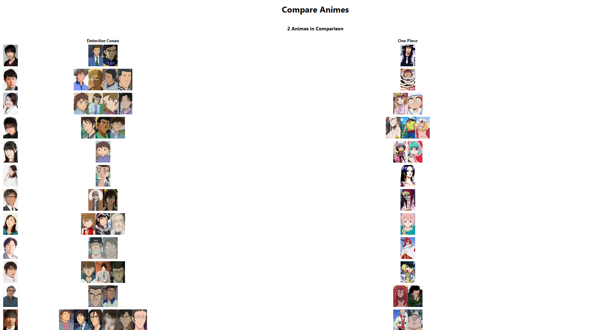
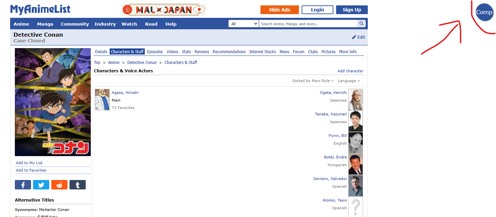
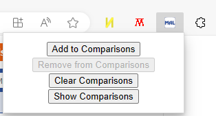

# MyAnimeList Comparison Extension

# Installation
**TL:DR**- Either: clone the repository and "install unpacked extension" (via **developer mode**) on the `MALComparisonExtension` subfolder; or download the `.CRX` file from the **Releases Page**, whitelist it, and install it.

<a href="https://adamantlife.github.io/browserextension.html">More in-depth information can be found here</a>

# Usage
When you navigate to the **Characters & Staff** page for an Anime, the extension will place a button in the top left corner. You can toggle this button on and off in order to add or remove Anime from the comparison.

&nbsp;

Alternatively, you can use the Extenion's **Page Action** (toolbar icon).

&nbsp;

To see the comparisons, either click *Show Comparisons* in the **Page Action** popup or navigate to the Extension's Option Page (via **Manage Extensions**).

Comparisons are saved in *Session Storage* so they automatically are removed when your browser restarts. Alternatively you can use the *Clear Comparisons* button in the **Page Action**.